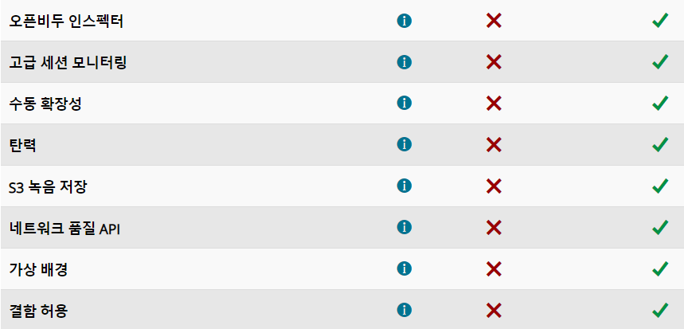
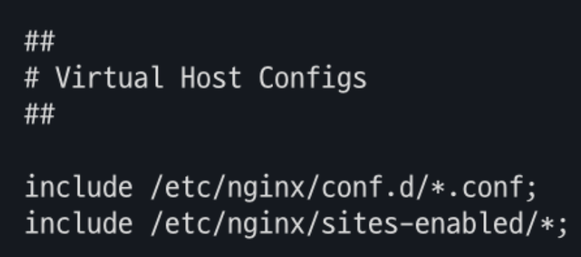

## Openvidu 체험

##### 2-1. 사용 기술

docker 20.10.12버전

npm

##### 2-2. 구현 순서

튜토리얼 파일 clone하기

```
git clone https://github.com/OpenVidu/openvidu-tutorials.git -b v2.21.0
```

git bash로 openvidu-library-react 폴더 이동 후 파일 실행

```
cd openvidu-tutorials/openvidu-library-react
npm install
npm start
```

자동으로 localhost:3000이 뜰 것이다.


동일한 경로의 다른 터미널을 열고 도커를 실행한다.

1.docker desktop 실행

2.

```
docker run -p 4443:4443 --rm -e OPENVIDU_SECRET=MY_SECRET openvidu/openvidu-server-kms:2.21.0
```


localhost:3000페이지의 join을 누른다.

카메라 등이 켜지지 않는다면 chrome권한설정을 확인한다.


##### 2-3. 사용 가능한 기능

마이크 카메라, 화면 공유, 전체화면, 채팅, 카메라전환, 종료


#### 3. openvidu 기본과 pro(유료)의 차이



### 4. openvidu 1:1 연결

```
npm install -g http-server
```

```
http-server openvidu-tutorials/openvidu-hello-world/web
```

여기서는 튜토리얼의 문서를 사용했으나 개발 진척시 백엔드에서 가능할 듯


```
docker run -p 4443:4443 --rm -e OPENVIDU_SECRET=MY_SECRET openvidu/openvidu-server-kms:2.22.0
```

도커의 버전에 주의

서로 다른 ip를 연결할 매개체인 도커를 준비한다.


```
http-server openvidu-tutorials/openvidu-iframe/web
```

다른 터미널에서 실행


결과


### 배포 및 인증서 발급

nginx 설치

```
$ sudo apt-get update #운영체제에서 사용 가능한 패키지들과 그 버전에 대한 정보(리스트) 업데이트 
$ sudo apt install nginx -y #nginx 설치하기
$ nginx -v #설치한 nginx 버전 확인
$ sudo service nginx status #nginx running 상태 확인
```

certbot으로 인증서 발급


certbot 설치

```
add-apt-repository ppa:certbot/certbot
```

리소스 업데이트

```
$ apt-get update
```

```
apt-get install python3-certbot-nginx
```

certbot으로 도메인(example.com)에 대한 인증서 발급

```
$ certbot certonly --nginx -d example.com
```

경로에서 5개의 파일이 생성되었는지 확인

```
$ ls -al /etc/letsencrypt/live/example.com
total 12
drwxr-xr-x 2 root root 4096 Aug 21 23:03 .
drwx------ 3 root root 4096 Aug 21 23:03 ..
-rw-r--r-- 1 root root  692 Aug 21 23:03 README
lrwxrwxrwx 1 root root   41 Aug 21 23:03 cert.pem -> ../../archive/example.com/cert1.pem
lrwxrwxrwx 1 root root   42 Aug 21 23:03 chain.pem -> ../../archive/example.com/chain1.pem
lrwxrwxrwx 1 root root   46 Aug 21 23:03 fullchain.pem -> ../../archive/example.com/fullchain1.pem
lrwxrwxrwx 1 root root   44 Aug 21 23:03 privkey.pem -> ../../archive/example.com/privkey1.pem
```


인증서 자동 갱신

```
$ sudo certbot renew --dry-run
```


https://도메인 주소를 칠 때 spring boot 서비스로 접속가능하게 nginx 설정파일 수정필요하다

```
$ cd /etc/nginx
$ vi nginx.conf
```



해당 코드가 없으면 추가해준다


/etc/nginx/sites-available 아래 test.conf파일을 만든다

```
server {
  listen 80; #80포트로 받을 때
  server_name example.com; #도메인주소, 없을경우 localhost
  return 301 https://example.com$request_uri;

}
server {
  listen 443 ssl http2;
  server_name example.com;

  # ssl 인증서 적용하기
  ssl_certificate /etc/letsencrypt/live/example.com/fullchain.pem;
  ssl_certificate_key /etc/letsencrypt/live/example.com/privkey.pem;
  
  location / { # location 이후 특정 url을 처리하는 방법을 정의(여기서는 / -> 즉, 모든 request)
    proxy_pass https://localhost:8443; # Request에 대해 어디로 리다이렉트하는지 작성. 8443 -> 자신의 springboot app이사용하는 포트
    proxy_set_header Host $http_host;
    proxy_set_header X-Real-IP $remote_addr;
    proxy_set_header X-Forwarded-For $proxy_add_x_forwarded_for;
    proxy_set_header X-Forwarded-Proto $scheme;
  }
}
server {
    if ($host = example.com) {
        return 301 https://$host$request_uri;
    } # managed by Certbot


  listen 80;
  server_name example.com;
    return 404; # managed by Certbot


}
```

맨 위 서버블럭->http로 들어오는 모든 요청을 https로 리다이렉트

다음 서버블럭->https://도메인으로 들어온 요청에 대해 localhost 8443포트로 접속가능하게 해줌

8443포트==>spring boot앱이므로 즉 도메인 이름으로 접속시 spring boot로 연결이 가능한 것이다


test.conf를 저장 후 빠져나와 sites-enabled에 심볼릭 링크만들기

```
sudo ln -s /etc/nginx/sites-available/test.conf /etc/nginx/sites-enabled
```


sites-enabled에서 test.conf가 추가된 것을 확인

```
$ cd /etc/nginx/sites-enabled
$ ls -l
total 0
lrwxrwxrwx 1 root root 34 Aug 21 22:18 default -> /etc/nginx/sites-available/default
lrwxrwxrwx 1 root root 36 Aug 21 23:58 test.conf -> /etc/nginx/sites-available/test.conf
```

에러가 생긴다면 default.conf를 지워보자


nginx 재구동 및 시작

```
$ sudo service nginx reload
또는
$ sudo service nginx restart
```

